---
## Front matter
title: "Лабораторная работа №8. "
subtitle: "Команды безусловного и условного переходов в Nasm. Программирование ветвлений."
author: "Хрусталев Влад Николаевич"

## Generic otions
lang: ru-RU
toc-title: "Содержание"

## Bibliography
bibliography: bib/cite.bib
csl: pandoc/csl/gost-r-7-0-5-2008-numeric.csl

## Pdf output format
toc: true # Table of contents
toc-depth: 2
lof: true # List of figures
fontsize: 12pt
linestretch: 1.5
papersize: a4
documentclass: scrreprt
## I18n polyglossia
polyglossia-lang:
  name: russian
  options:
	- spelling=modern
	- babelshorthands=true
polyglossia-otherlangs:
  name: english
## I18n babel
babel-lang: russian
babel-otherlangs: english
## Fonts
mainfont: PT Serif
romanfont: PT Serif
sansfont: PT Sans
monofont: PT Mono
mainfontoptions: Ligatures=TeX
romanfontoptions: Ligatures=TeX
sansfontoptions: Ligatures=TeX,Scale=MatchLowercase
monofontoptions: Scale=MatchLowercase,Scale=0.9
## Biblatex
biblatex: true
biblio-style: "gost-numeric"
biblatexoptions:
  - parentracker=true
  - backend=biber
  - hyperref=auto
  - language=auto
  - autolang=other*
  - citestyle=gost-numeric
## Pandoc-crossref LaTeX customization
figureTitle: "Рис."
tableTitle: "Таблица"
listingTitle: "Листинг"
lofTitle: "Список иллюстраций"
lotTitle: "Список таблиц"
lolTitle: "Листинги"
## Misc options
indent: true
header-includes:
  - \usepackage{indentfirst}
  - \usepackage{float} # keep figures where there are in the text
  - \floatplacement{figure}{H} # keep figures where there are in the text
---

# Цель работы

Изучение команд условного и безусловного переходов. Приобретение навыков написания программ с использованием переходов. Знакомство с назначением и структурой файла листинга.

# Выполнение лабораторной работы

Создадим каталог для программам лабораторной работы № 8, перейдем в него и создадим файл lab8-1.asm(рис. [-@fig:001])

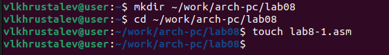{ #fig:001 width=70% }

Введем в файл lab8-1.asm текст программы из листинга 8.1.(рис. [-@fig:002])

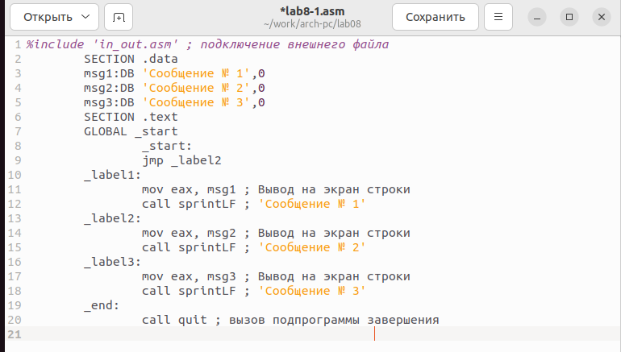{ #fig:002 width=70% }

Создадим исполняемый файл и запустим его.(рис. [-@fig:003])

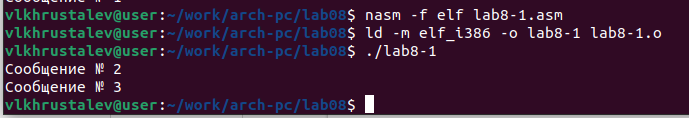{ #fig:003 width=70% }

Далее изменим текст программы в соответствии с листингом 8.2(рис. [-@fig:004])

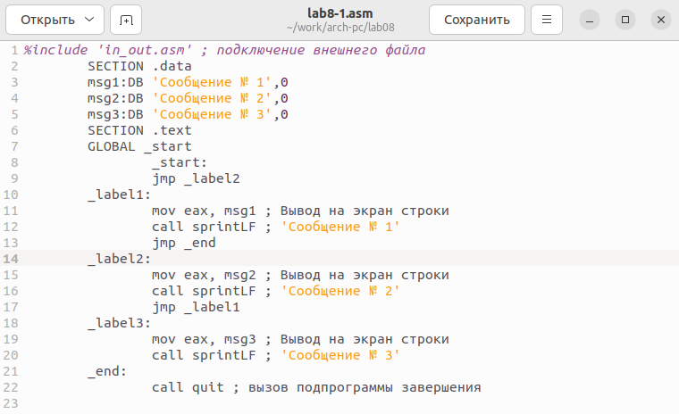{ #fig:004 width=70% }

Создадим исполняемый файл исправленного текста программы lab8-1.asm и запустим его.(рис. [-@fig:005])

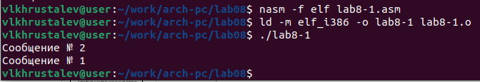{ #fig:005 width=70% }

Требуемый вывод:

user@dk4n31:~$ ./lab8-1

Сообщение № 3

Сообщение № 2

Сообщение № 1

user@dk4n31:~$(рис. [-@fig:006])

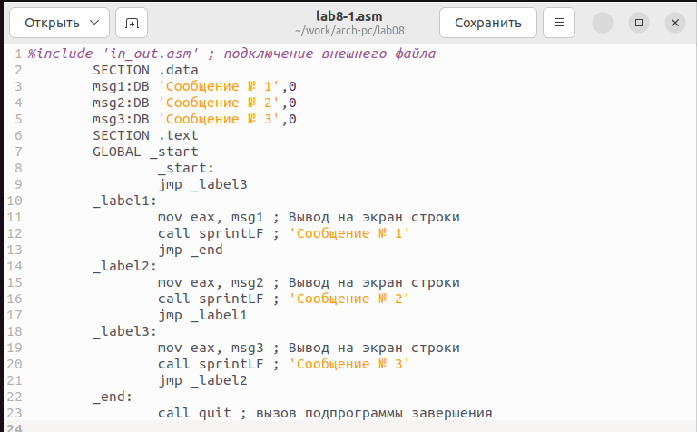{ #fig:006 width=70% }

Создадим исполняемый файл и запустим его(рис. [-@fig:007])

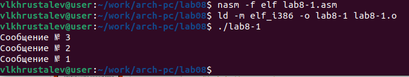{ #fig:007 width=70% }

Создадим файл lab8-2.asm в каталоге ~/work/arch-pc/lab08. Внимательно изучим текст программы из листинга 8.3 и введем в lab8-2.asm.(рис. [-@fig:008])

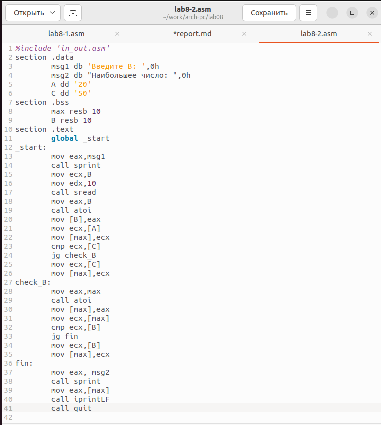{ #fig:008 width=70% }

Создадим измененный исполняемый файл и запустим его(рис. [-@fig:009])

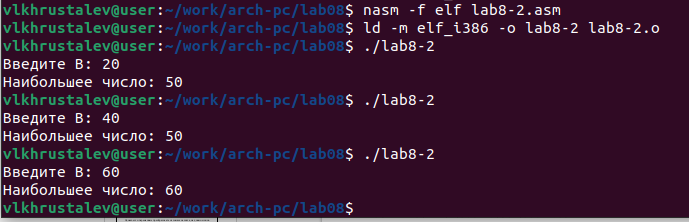{ #fig:009 width=70% }

Создадим файл листинга для программы из файла lab8-2.asm и откроем файл при помощи текстового редактора mcedit(рис. [-@fig:010])

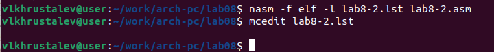{ #fig:010 width=70% }

Разберем три строки листинга программы

15 000000F2 B9[0A000000]            	mov ecx,B

Значение строки:

15-номер строки в коде листинга от начала сегмента
		
000000F2 - адрес
		
B9[0A000000] - машинный код(B9[0A000000] - инструкция mov ecx,B; B9 - обозначет что действие производится с регистром ecx, а конкретно mov ecx(в данной программе) ;  [0A000000] - ссылка на переменную B)
		
mov ecx,B - исходный текст программы
		
16 000000F7 BA0A000000              	mov edx,10

Значение строки:

16-номер строки в коде листинга от начала сегмента
		
000000F7 - адрес
		
BA0A000000 - машинный код(BA0A000000 - инструкция mov edx,10 ; BA - обозначает что работает с с регисторм edx)
		
mov edx,10 - исходный текст программы

17 000000FC E842FFFFFF              	call sread

Значение строки:

17-номер строки в коде листинга от начала сегмента
		
000000FC - адрес
		
E842FFFFFF - машинный код(E842FFFFFF - инструкция call sread, E8 - значит что рабоает через переменную eax)
		
call sread - исходный текст программы(рис. [-@fig:011])

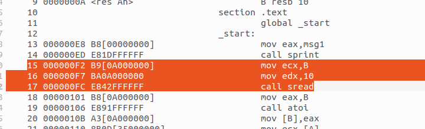{ #fig:011 width=70% }

Откроем файл с программой lab8-2.asm и в любой инструкции с двумя
операндами удалим один операнд. Выполните трансляцию с получением файла
листинга:(рис. [-@fig:012])

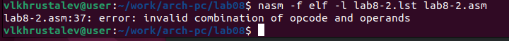{ #fig:012 width=70% }

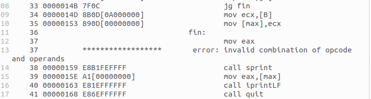{ #fig:013 width=70% }

На выходе получаем листинг lab8-2.lst с ошибкой 46         ******************       error: invalid combination of opcode and operands

#Самостоятельная работа

Выполняем вариант номер 12

Напишем программу нахождения наименьшей из 3 целочисленных переменных A, B, C. Значения переменных выберем из табл. 8.5 в соответствиис вариантом, полученным при выполнении лабораторной работы № 7. Создадим исполняемый файл и проверьте его работу.(рис. [-@fig:014])

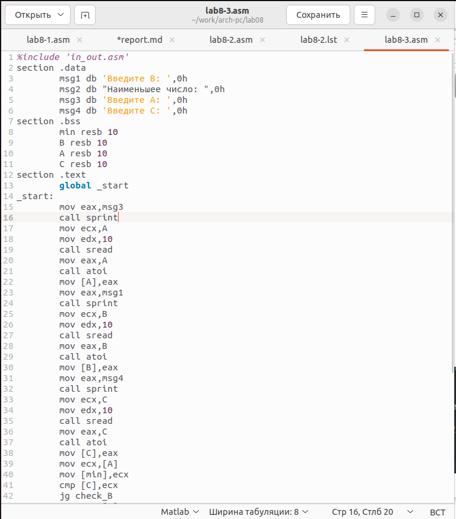{ #fig:014 width=70% }

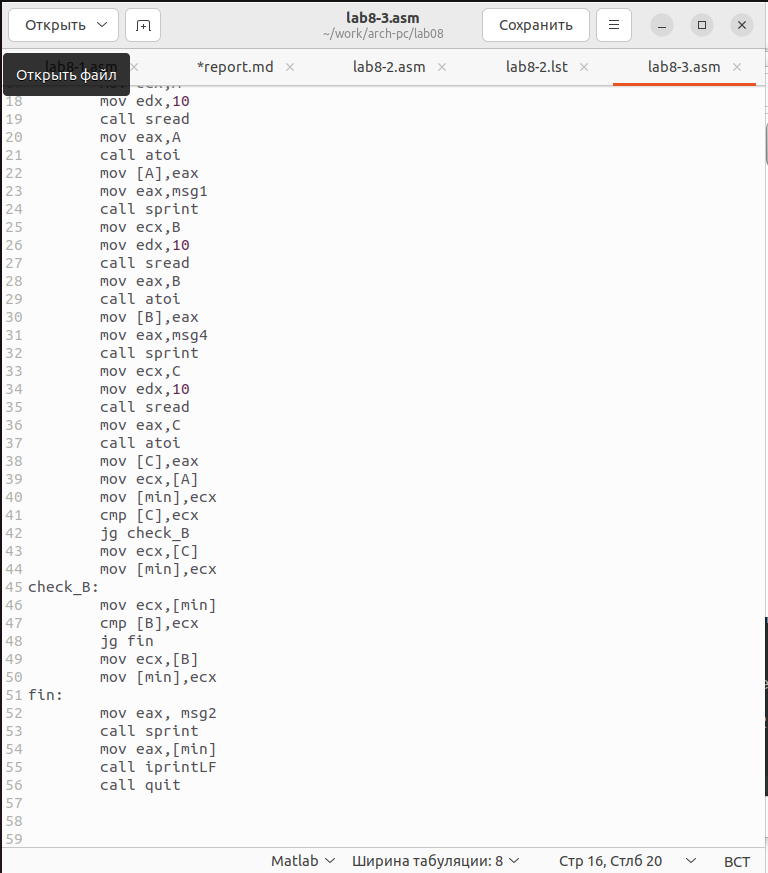{ #fig:015 width=70% }

Проверим работу исполняемого файла(рис. [-@fig:016])

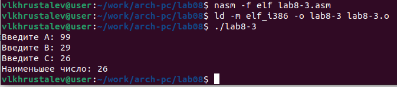{ #fig:016 width=70% }

Напишем программу, которая для введенных с клавиатуры значений x и a вычисляет значение заданной функции f(x) и выводит результат вычислений. Вид функции f(x) выбрать из таблицы 8.6 вариантов заданий в соответствии с вариантом, полученным при выполнении лабораторной работы № 7. Создайте исполняемый файл и проверьте его работу для значений x и a из 8.6.(рис. [-@fig:017])

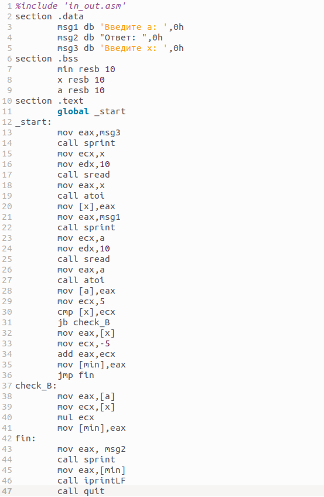{ #fig:017 width=70% }

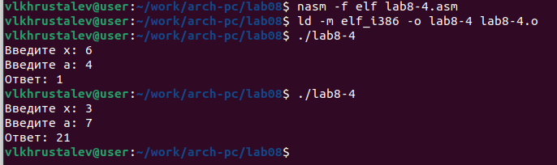{ #fig:018 width=70% }

# Выводы

В ходе лабораторной работы мы изучили команды условного и безусловного переходов, приобрели навыки написания программ с использованием переходов, познакомились с назначением и структурой файла листинга.

Ссылка на github: https://github.com/bezura/study_2022-2023_arch-pc
