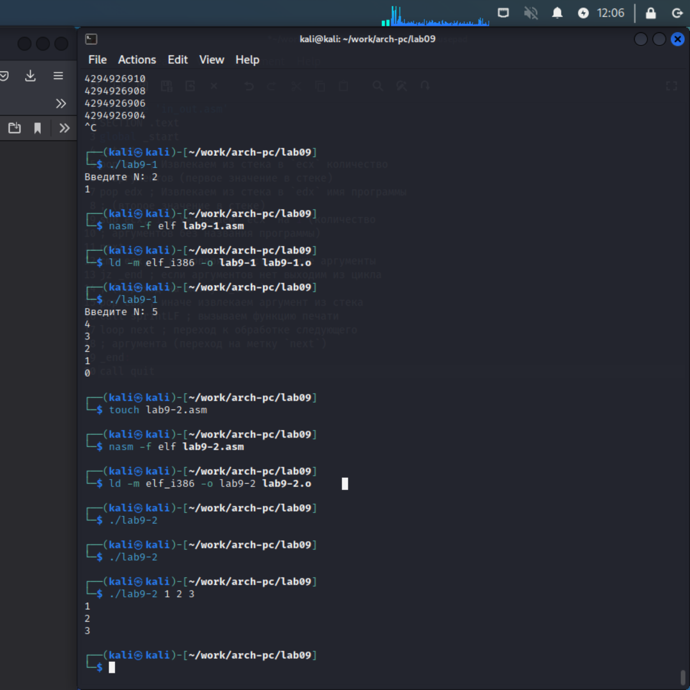
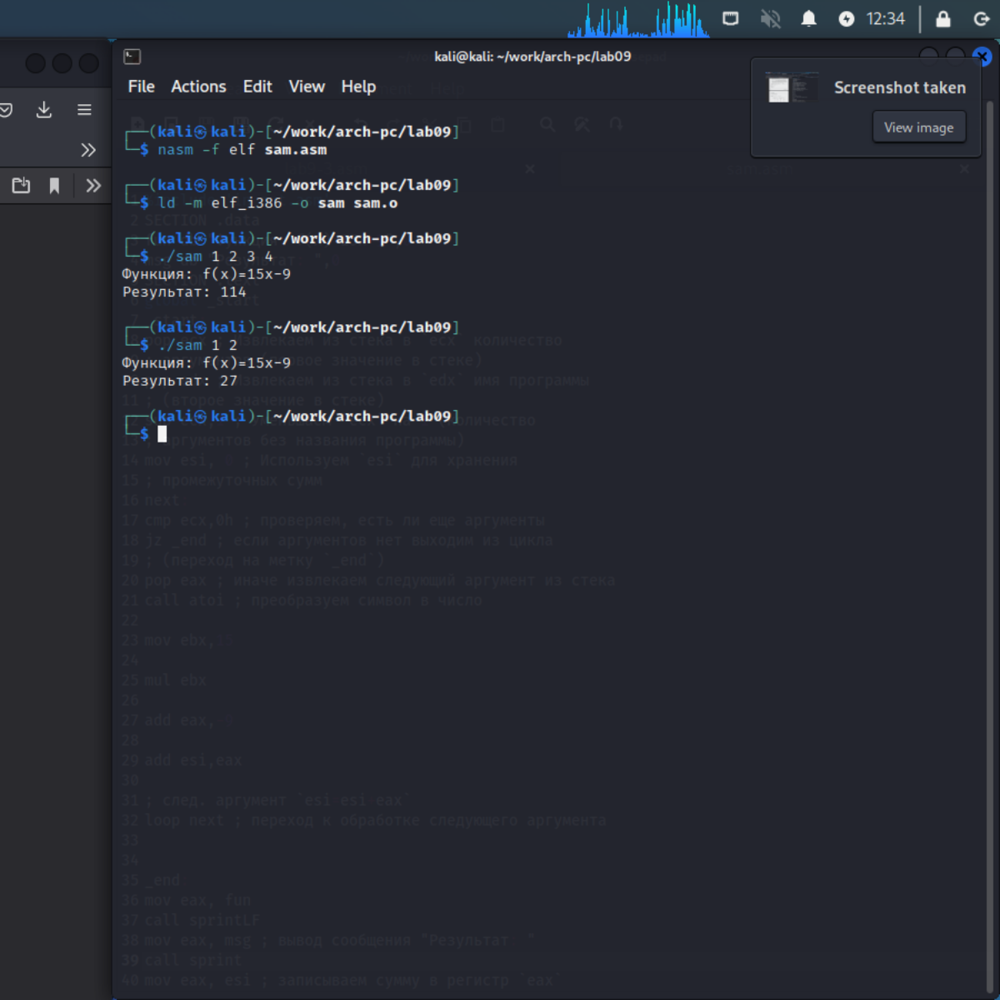

---
## Front matter
title: "Лабораторная работа No9"
subtitle: "Программирование цикла. Обработка аргументов командной строки."
author: "Хрусталев Влад Николаевич"

## Generic otions
lang: ru-RU
toc-title: "Содержание"

## Bibliography
bibliography: bib/cite.bib
csl: pandoc/csl/gost-r-7-0-5-2008-numeric.csl

## Pdf output format
toc: true # Table of contents
toc-depth: 2
lof: true # List of figures
fontsize: 12pt
linestretch: 1.5
papersize: a4
documentclass: scrreprt
## I18n polyglossia
polyglossia-lang:
  name: russian
  options:
	- spelling=modern
	- babelshorthands=true
polyglossia-otherlangs:
  name: english
## I18n babel
babel-lang: russian
babel-otherlangs: english
## Fonts
mainfont: PT Serif
romanfont: PT Serif
sansfont: PT Sans
monofont: PT Mono
mainfontoptions: Ligatures=TeX
romanfontoptions: Ligatures=TeX
sansfontoptions: Ligatures=TeX,Scale=MatchLowercase
monofontoptions: Scale=MatchLowercase,Scale=0.9
## Biblatex
biblatex: true
biblio-style: "gost-numeric"
biblatexoptions:
  - parentracker=true
  - backend=biber
  - hyperref=auto
  - language=auto
  - autolang=other*
  - citestyle=gost-numeric
## Pandoc-crossref LaTeX customization
figureTitle: "Рис."
tableTitle: "Таблица"
listingTitle: "Листинг"
lofTitle: "Список иллюстраций"
lotTitle: "Список таблиц"
lolTitle: "Листинги"
## Misc options
indent: true
header-includes:
  - \usepackage{indentfirst}
  - \usepackage{float} # keep figures where there are in the text
  - \floatplacement{figure}{H} # keep figures where there are in the text
---

# Цель работы

Приобретение навыков написания программ с использованием циклов и обработкой аргументов командной строки.

# Выполнение лабораторной работы

Создадим файл lab9-1.asm (рис. [-@fig:001])

{ #fig:001 width=70% }

Введём программу из листинга 9.1 (рис. [-@fig:002])

{ #fig:002 width=70% }

Проверим его работу (рис. [-@fig:003])

{ #fig:003 width=70% }

Изменим текст программы по инструкции в лабораторной добавив изменение регистра ecx (рис. [-@fig:004])

{ #fig:004 width=70% }

Проверим его работу и выясним, что из-за изменения регистра ecx число подходов цикла не сответсвует числу введеному в программу (рис. [-@fig:005])

{ #fig:005 width=70% }

Изменим программу добавив команды push и pop (рис. [-@fig:006])

{ #fig:006 width=70% }

Проверим работоспособность и выясним что число циклов соотсветсвует заданному(рис. [-@fig:007])

{ #fig:007 width=70% }

Создадим файл lab9-2.asm и введём в него текст программы из лситинга 9.2 (рис. [-@fig:008])

{ #fig:008 width=70% }

Проверим его рабоспособность все аргументы были обработаны (рис. [-@fig:009])

{ #fig:009 width=70% }

Создадим файл lab9-3.asm (рис. [-@fig:010])

{ #fig:010 width=70% }

Введём программу из листинга 9.3 (рис. [-@fig:011])

{ #fig:011 width=70% }

Проверим как работает программа на данных из лабораторной (рис. [-@fig:012])

{ #fig:012 width=70% }

Изменим эту программу так, чтобы она вычисляла произведение аргументов (рис. [-@fig:013])

{ #fig:013 width=70% }

Проверим его работоспособность (рис. [-@fig:014])

{ #fig:014 width=70% }

# Выполение самостоятельной работы

Мой вариант 12, то есть самостоятельная работа: сумма всех f(x), где x аргументы, а f(x)=15x-9. 

Напишем программу чтобы выполняла эту задачу(рис. [-@fig:015])

{ #fig:015 width=70% }

Проверим его рабоспособность на паре примеров и убедимся в рабоспособности (рис. [-@fig:016])

{ #fig:016 width=70% }

# Выводы

На данной лабораторной я приобрёл навыки написания программ ассемблера NASM с использованием циклов и обработкой аргументов командной строки.

https://github.com/bezura/study_2022-2023_arch-pc
