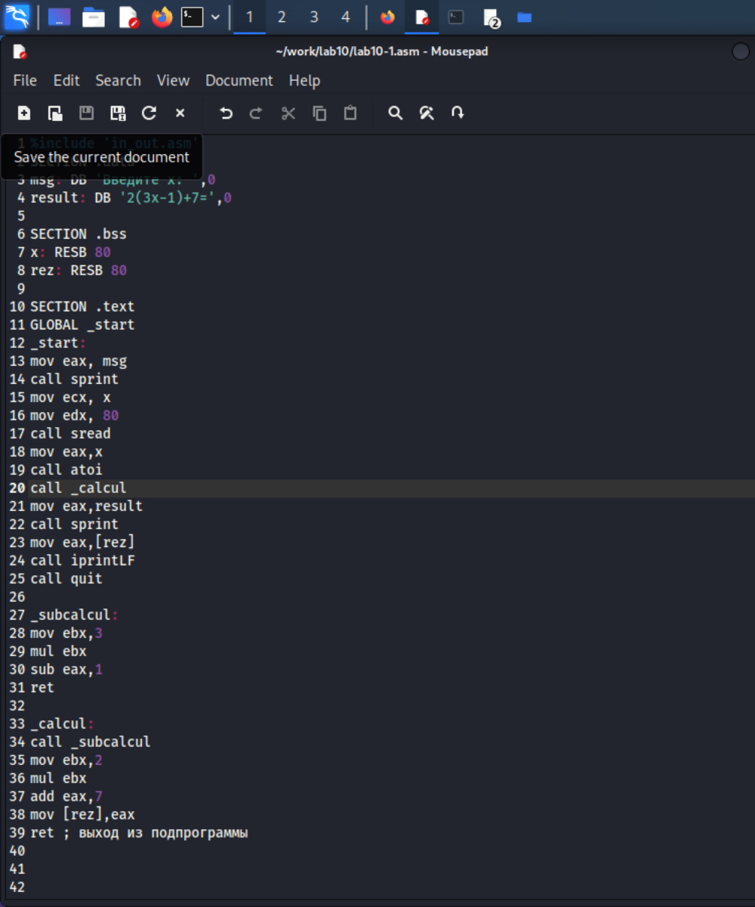
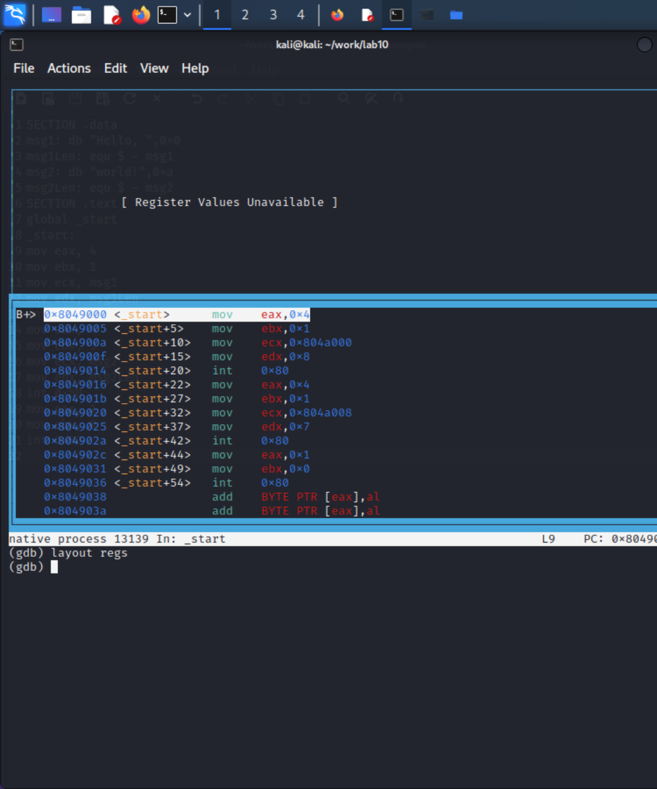

---
## Front matter
title: "Лабораторная работа No10"
subtitle: "Понятие подпрограммы. Отладчик GDB."
author: "Хрусталев Влад Николаевич"

## Generic otions
lang: ru-RU
toc-title: "Содержание"

## Bibliography
bibliography: bib/cite.bib
csl: pandoc/csl/gost-r-7-0-5-2008-numeric.csl

## Pdf output format
toc: true # Table of contents
toc-depth: 2
lof: true # List of figures
fontsize: 12pt
linestretch: 1.5
papersize: a4
documentclass: scrreprt
## I18n polyglossia
polyglossia-lang:
  name: russian
  options:
	- spelling=modern
	- babelshorthands=true
polyglossia-otherlangs:
  name: english
## I18n babel
babel-lang: russian
babel-otherlangs: english
## Fonts
mainfont: PT Serif
romanfont: PT Serif
sansfont: PT Sans
monofont: PT Mono
mainfontoptions: Ligatures=TeX
romanfontoptions: Ligatures=TeX
sansfontoptions: Ligatures=TeX,Scale=MatchLowercase
monofontoptions: Scale=MatchLowercase,Scale=0.9
## Biblatex
biblatex: true
biblio-style: "gost-numeric"
biblatexoptions:
  - parentracker=true
  - backend=biber
  - hyperref=auto
  - language=auto
  - autolang=other*
  - citestyle=gost-numeric
## Pandoc-crossref LaTeX customization
figureTitle: "Рис."
tableTitle: "Таблица"
listingTitle: "Листинг"
lofTitle: "Список иллюстраций"
lotTitle: "Список таблиц"
lolTitle: "Листинги"
## Misc options
indent: true
header-includes:
  - \usepackage{indentfirst}
  - \usepackage{float} # keep figures where there are in the text
  - \floatplacement{figure}{H} # keep figures where there are in the text
---

# Цель работы

Приобретение навыков написания программ с использованием подпрограмм. Знакомство с методами отладки при помощи GDB и его основными возможностями.

# Выполнение лабораторной работы

Создадим файл lab10-1.asm и введем в него программу из листинга 10.1(рис. [-@fig:001])

{ #fig:001 width=70% }

Запустим программу (рис. [-@fig:002])

{ #fig:002 width=70% }

Изменим программу в соответствии с заданием в лабораторной (рис. [-@fig:003])

{ #fig:003 width=70% }

Запустим программу (рис. [-@fig:004])

{ #fig:004 width=70% }

Создадим файл lab10-2.asm и ввём программу из листинга 10.2 (рис. [-@fig:005])

{ #fig:005 width=70% }

Создадим исполняемый файл lab10-2.asm (рис. [-@fig:006])

{ #fig:006 width=70% }

Запустим файл lab10-2.asm в gdb(рис. [-@fig:007])

{ #fig:007 width=70% }

Установим брейкметку на _start(рис. [-@fig:008])

{ #fig:008 width=70% }

Посмотрим дисассимилированный код программы c метки _start(рис. [-@fig:009])

{ #fig:009 width=70% }

Переключимся на отображение команд с Intel’овским синтаксисом, введя
команду set disassembly-flavor intel(рис. [-@fig:010])

{ #fig:010 width=70% }

Запустим режим псевдографики для более удобного анализа программы(рис. [-@fig:011])

{ #fig:011 width=70% }

{ #fig:012 width=70% }

{ #fig:013 width=70% }

Посмотрим инфо о брейкметках и добавим ещё одну на mov ebx, 0x0(рис. [-@fig:014])

{ #fig:014 width=70% }

Посмотрим значение переменной msg1(рис. [-@fig:017])

{ #fig:017 width=70% }

Посмотрим значение переменной msg1 и msg2(рис. [-@fig:017] и [-@fig:018]))

{ #fig:017 width=70% }

{ #fig:018 width=70% }

Изменим значсение msg1 (рис. [-@fig:019])

{ #fig:019 width=70% }

Ананлогично и msg2(рис. [-@fig:020])

{ #fig:020 width=70% }

Выведем значение регистра ecx и edx(рис. [-@fig:021])

{ #fig:021 width=70% }

Изменим значения регистра ebx(рис. [-@fig:022])

{ #fig:022 width=70% }

Разница в командах в том, что примваиваем значение числа во втором случае, а в первом символ '2'.

Скопирум файл lab9-2.asm и переименнуем в lab10-3.asm(рис. [-@fig:023])

{ #fig:023 width=70% }

Скомпилируем и запустим отладку, Поставить брейкметку и запустить (рис. [-@fig:024])

{ #fig:024 width=70% }

Посмотрим адрес стека, количество аргументов(рис. [-@fig:025])

{ #fig:025 width=70% }

Посмотрим остальные позиции стека, '+4' шаг потому, что (рис. [-@fig:026])

{ #fig:026 width=70% }

# Самостоятельная работа

Преобразуем программу из лабораторной работы 9 задание1 для сам работы, чтобы вычисления были в подпрограмме (рис. [-@fig:027])

{ #fig:027 width=70% }

Проверим работоспособность(рис. [-@fig:029])

{ #fig:029 width=70% }

Создадим файл для задания 2 сам. работы. И ввдём программу из листинга 10.3(рис. [-@fig:030])

{ #fig:030 width=70% }

Проверим программу с помощью отладчика  и найдем ошибку(рис. [-@fig:031])

{ #fig:031 width=70% }

Исправим ошибку(рис. [-@fig:032])

{ #fig:032 width=70% }

Запустим рабочую программу(рис. [-@fig:033])

{ #fig:033 width=70% }

# Выводы

Приобрел навыки написания программ с использованием подпрограмм. Ознакомился с методами отладки при помощи GDB и его основными возможностями.

https://github.com/bezura/study_2022-2023_arch-pc

